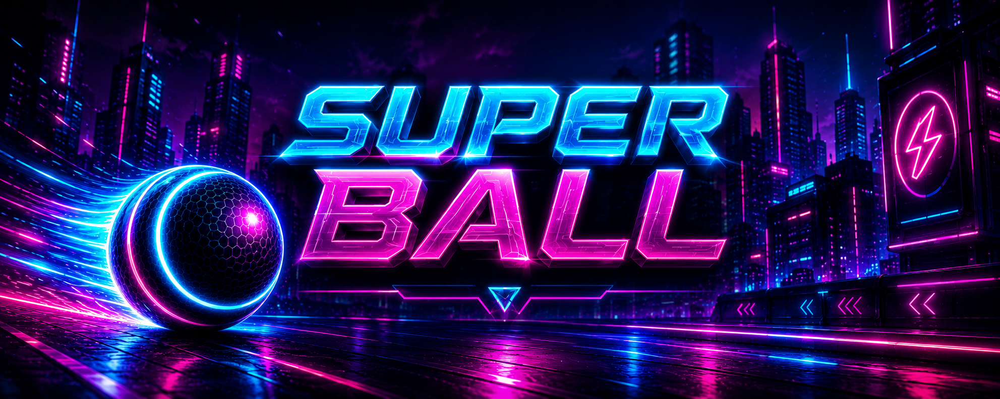
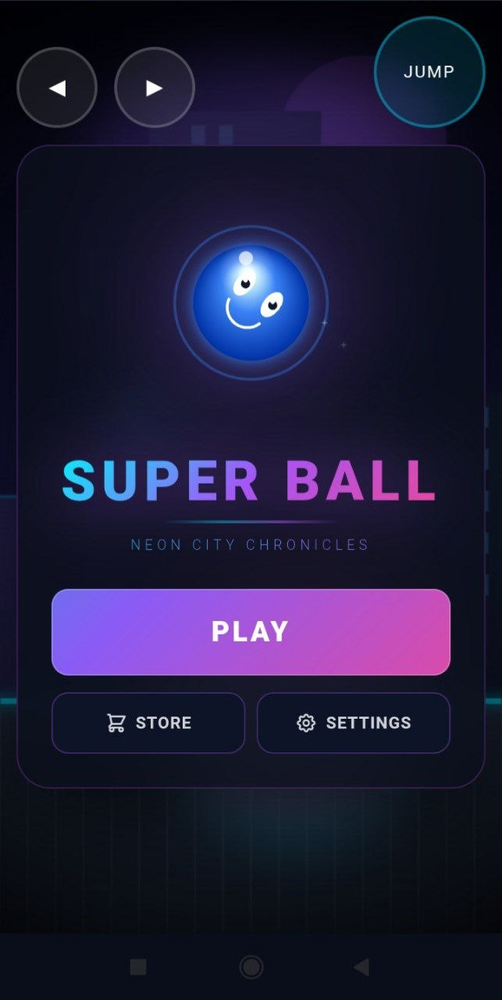
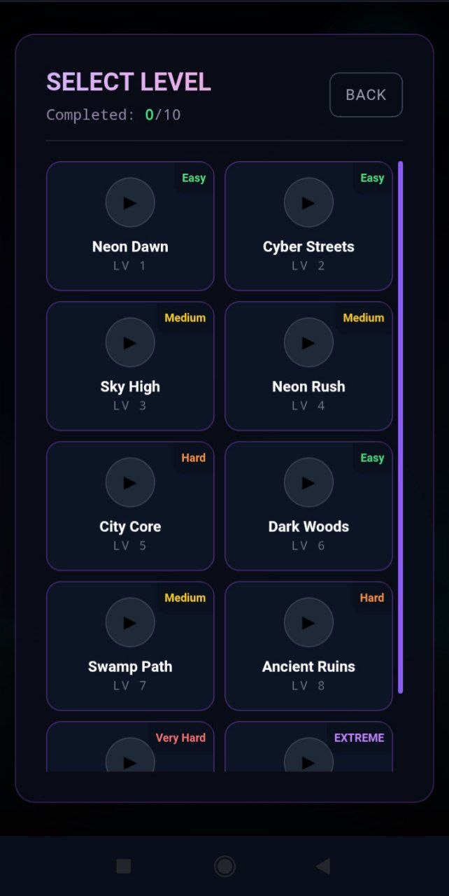
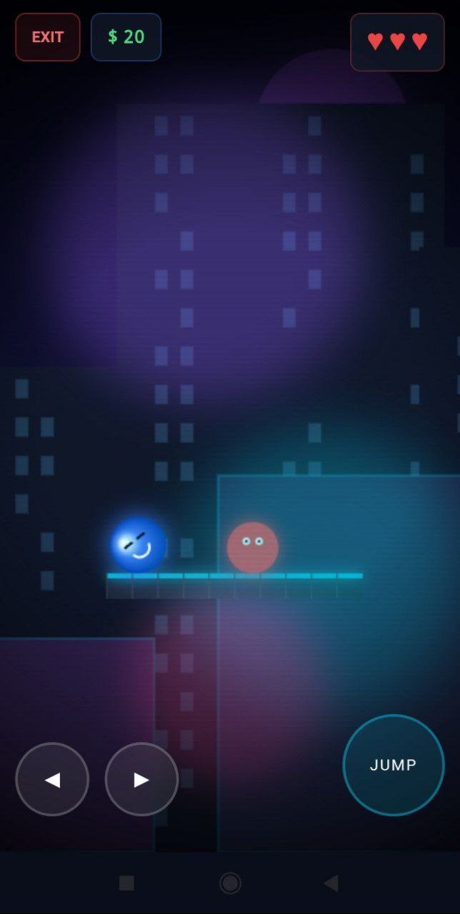
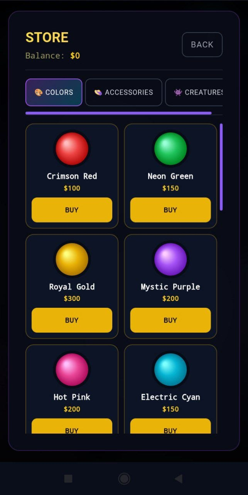
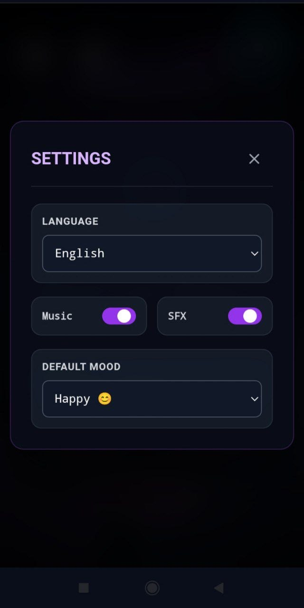
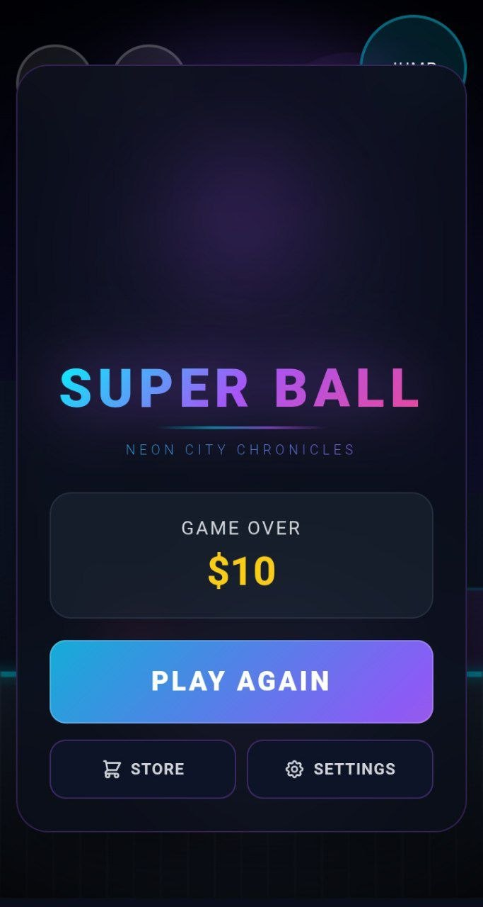

  

# 🎮 Super Ball: Neon City

A fast-paced neon arcade game built with HTML, CSS, and JavaScript.

Control a bouncing ball, dodge dangerous obstacles, collect coins, and purchase upgrades to survive longer and achieve the highest score.

---

## ✨ Features

- 🎯 Responsive gameplay
- 📱 Mobile-friendly controls
- 💰 Coin collection system
- 🛒 Upgrade shop
- 🌍 Multiple languages
- ⚙️ Settings menu
- 🎨 Neon-inspired visuals
- 🔊 Sound effects

---

## 🛠️ Technologies

- HTML5
- CSS3
- JavaScript (ES6)
- Canvas API

---

## 🚀 Play Online
🎮 Play here:

https://kymbatuagap5-cmd.github.io/Super-Ball-Neon-City/

## 🎥 Gameplay

---

## 📸 Screenshots

---

## 📈 Future Improvements

- Progressive Web App (PWA)
- Achievement system
- Online leaderboard
- Additional levels
- More upgrades
- New visual effects

---

## 👨‍💻 Author

Developed by **Kymbat Uagap**